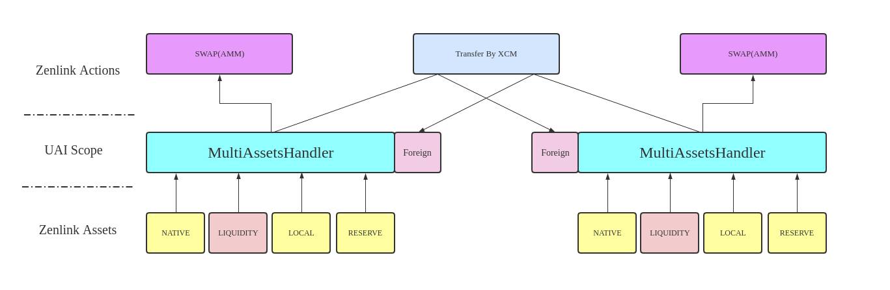

## Zenlink Protocol v0.4.0 Overview


`Zenlink Protocol` mainly consists of two parts: assets and asset operations, 
namely `Zenlink Assets` and `Zenlink Actions`.
Through the `UAI`(unified asset identifier) and `MultiAssetsHandler` interfaces, 
`Zenlink` can perform `Swap` and `Transfer By XCM` any asset on the chain.

## Zenlink Protocol v0.4.0 Features
- Based on the `newest` XCM design
- Based on `FRAMEv2`
- `Compatible` Polkadot XCMP cross-chain asset processing
- Zenlink Protocol registration whitelist-XCM `trust collection management`
- Through Transfer-By-XCM, `assets can flow freely` between parachains
- ZenlinkMultiAssets adapter comes with `LIQUIDITY` and `Foreign` asset processing, which can `adapt to various native assets such as NATIVE/LOCAL/RESERVE`
- Provide LocalAssetHandler, OtherAssetHandler and other traits to `support locally defined assets such as LOCAL and RESERVE`
- Under the control of MultiAssetsHandler, `assets can swap freely`
- Add `protocol fee manage` feature(fee_admin,fee_receiver,fee_point)

##  UAI v0.1.0

- UAI v0.1.0 definition

```rust
pub struct AssetId {
    pub chain_id: u32, // ParaId
    pub asset_type: u8, // Asset types supported by Zenlink Assets
    pub asset_index: u32, // the index number of the asset
}
```

- UAI v0.1.0 asset type

`asset_type` currently only supports the following values:

```rust
/// Native currency, the most basic asset on each parachain
pub const NATIVE: u8 = 0;
/// Swap module asset, LP token generated by Zenlink DEX
pub const LIQUIDITY: u8 = 1;
/// Other asset type on this chain, other asset modules on this chain
pub const LOCAL: u8 = 2;
/// Reserved for future, reserved asset type
pub const RESERVED: u8 = 3;
```

In the current version of UAI, `Zenlink Assets` supports up to four locally defined assets of `Native/LIQUIDITY/LOCAL/RESERVED`.
When these four assets are transferred across chains, a cross-chain mapping asset category `Foreign` will be generated inside `ZenlinkProtocol`.

- `Before and after the cross-chain asset transfer, the UAI of the asset has not changed`.

## MultiAssetsHandler

The trait is defined as follows
```rust
pub trait MultiAssetsHandler<AccountId> {
    fn balance_of(asset_id: AssetId, who: &AccountId) -> AssetBalance;
    fn total_supply(asset_id: AssetId) -> AssetBalance;
    fn is_exists(asset_id: AssetId) -> bool;
    fn transfer(
        asset_id: AssetId,
        origin: &AccountId,
        target: &AccountId,
        amount: AssetBalance,
    ) -> DispatchResult {
        let withdrawn = Self::withdraw(asset_id, origin, amount)?;
        let _ = Self::deposit(asset_id, target, withdrawn)?;
        Ok(())
    }
    fn deposit(
        asset_id: AssetId,
        target: &AccountId,
        amount: AssetBalance,
    ) -> Result<AssetBalance, DispatchError>;

    fn withdraw(
        asset_id: AssetId,
        origin: &AccountId,
        amount: AssetBalance,
    ) -> Result<AssetBalance, DispatchError>;
}

```

- `is_exists` is a unified access interface for `Zenlink Actions`
- `balance_of`, `total_supply`, `transfer` are `Zenlink Swap Action` access interface
- `deposit`, `withdraw` are `Zenlink Transfer-By-XCM Action` access interface
- `MultiAssetsHandler` can operate in addition to the four native defined assets identified by `UAI`, 
as well as the `cross-chain mapping asset Foreign` inside `ZenlinkProtocol`.


## Swap and Transfer-By-XCM
- Four native defined assets (`NATIVE/LIQUIDITY/LOCAL/RESERVED`) and cross-chain mapping assets (`Foreign`) can be exchanged through `MultiAssetsHandler`.
- Four native defined assets (`NATIVE/LIQUIDITY/LOCAL/RESERVED`) Cross-chain asset transfer through `Transfer-By-XCM`, and a mapped asset `Foreign` is generated 
on the target parachain, Also through the `Transfer-By-XCM` cross-chain transfer back to the original definition chain of the asset.


## License

[GPL-v3](LICENSE)
